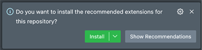

[![Contributors][contributors-shield]][contributors-url]
[![Issues][issues-shield]][issues-url]
[![License][license-shield]][license-url]

<br />

<div align="center">
  <a href="https://github.com/gabruw/react-native-boilerplate">
    
  </a>

  <h3 align="center">Gabruw's React Native Boilerplate</h3>

  <p align="center">
    A complete boilerplate to be completed by your code
  </p>
</div>

## 💾 Info

### 🧰 OS

![Android][android]
![IOS][ios]

### 🤖 Technologies

[![Node.js][node.js]][node-url]
[![React Native][react-native]][react-native-url]
[![Expo][expo]][expo-url]

### ⚙ First-class Support

[![Jest][jest]][jest-url]
[![Apollo GraphQL][apollo-graphql]][apollo-graphql-url]

[![Visual Studio Code][vscode]][vscode-url]
[![TypeScript][typescript]][typescript-url]
[![Yarn][yarn]][yarn-url]

## 🔰 Getting Started

This project can help you to build your own **React Native Application** faster.

You will find a clean project to evolve as you want with basic libs, configured workspace, lint, integration with Github Actions and zero production dependencies.

### 📋 Pre-requisites

You will need to have the following softwares installed already:

[![Node.js version][node.js-version]][node.js-installation]
[![Yarn version][yarn-version]][yarn-installation]

> If you don't have the softwares installed, click on the badges to be redirected to the installation tutorial.

## 📌 Installation

### 🏷 How to use as template

You can click on "**Use this template**" button in the top of this page to create your own project based on it.

### 🔩 Local setup

##### 1 - VS Code

When you open the project in VS Code, the pop-up recommending the workspace extensions will be shown in left bottom.\
I strongly recommend you to install them, cause this boilerplate was thought to use them.



##### 2 - Dependencies

The project only has developer dependencies, to install them run:

```bash
yarn install
```

Run the mount command to install the global package dependencies:

```bash
yarn mount
```

##### 3 - Pre build

Generate the pre build command to update the android and ios projects to be able to run the project:

```bash
yarn prebuild
```

##### 4 - Debug

As were specified on "Technologies" topic, the project has first class support for [React Native Debugger](https://github.com/jhen0409/react-native-debugger). If you wanna know how to install and run the React Native Debugger, [clicking here](https://github.com/jhen0409/react-native-debugger).

## 🏗 Structure

### 🏘 Domain, module and folders

All the folders except **pages folder** is considered global stuff, and the same structure needs to be replicated inside every page that's, if needed. Every page is a new module, and for module, we can define as a collection of files that was created to support the same motivation (domain).

### 🌍 Nomenclature

| Pattern                                                   | Category                             |
| --------------------------------------------------------- | ------------------------------------ |
| [Pascal Case](https://en.wiktionary.org/wiki/Pascal_case) | Components                           |
| [Camel Case](https://en.wiktionary.org/wiki/CamelCase)    | Functions and hooks                  |
| [Kebab Case](https://en.wiktionary.org/wiki/kebab_case)   | Folders, constants, types and assets |

### 🗃 Tests

All test files needs **.test.** suffix to be recognize for Jest configuration.

You will found 3 types of test folders:

| Folder           | Description                                                                         |
| ---------------- | ----------------------------------------------------------------------------------- |
| \_\_tests\_\_    | A collection of test files from that module                                         |
| \_\_mocks\_\_    | A collection of mocks generated by jest.mock functions                              |
| \_\_fixtures\_\_ | A collection of functions and constants that will be used in one or more test files |

## 🏛 Architecture

This project is based in [MVC](https://pt.wikipedia.org/wiki/MVC) pattern.

All components must be separated as:

| Type           | Description                                                                                                    |
| -------------- | -------------------------------------------------------------------------------------------------------------- |
| View           | use the index files to define the visual elements                                                              |
| Types          | use files with **.d.ts** extension. In case of more than one file, create a folder to aggregate them           |
| API            | use hooks to query, and separate the types in another file. It will be called in index files or business rules |
| Business rules | use hooks, storages, functions and constants that will be called between them or inside index files            |

## 🔖 Features

| Test | Idiom   | Router     | API           | Form      | Storage       | Security     | Utils    | CI/Quality | Visual            |
| ---- | ------- | ---------- | ------------- | --------- | ------------- | ------------ | -------- | ---------- | ----------------- |
| Jest | I18next | Navigation | Apollo Client | Zod       | Redux         | Jail Breaker | Camera   | Husky      | Paper             |
|      |         |            |               | Hook Form | Async Storage | Cache Loader | Net Info | ESLint     | Lottie            |
|      |         |            |               |           |               |              |          | Prettier   | Inter Fonts       |
|      |         |            |               |           |               |              |          |            | Splash Screen     |
|      |         |            |               |           |               |              |          |            | Styled Components |

## 📑 License

Distributed under the MIT License. See [LICENSE](https://github.com/gabruw/react-native-boilerplate/blob/main/LICENSE) for more information.

<!-- ASSETS -->

<!-- TOP INFO - BADGE - Contributors -->

[contributors-shield]: https://img.shields.io/github/contributors/gabruw/react-native-boilerplate.svg?style=for-the-badge
[contributors-url]: https://github.com/gabruw/react-native-boilerplate/graphs/contributors

<!-- TOP INFO - BADGE - Issues -->

[issues-shield]: https://img.shields.io/github/issues/gabruw/react-native-boilerplate.svg?style=for-the-badge
[issues-url]: https://github.com/gabruw/react-native-boilerplate/issues

<!-- TOP INFO - BADGE - License -->

[license-shield]: https://img.shields.io/github/license/gabruw/react-native-boilerplate.svg?style=for-the-badge
[license-url]: https://github.com/gabruw/react-native-boilerplate/blob/main/LICENSE.md

<!-- OS - BADGE - IOS -->

[ios]: https://img.shields.io/badge/iOS-000000?style=for-the-badge&logo=ios&logoColor=white

<!-- OS - BADGE - Android -->

[android]: https://img.shields.io/badge/Android-71B755?style=for-the-badge&logo=android&logoColor=white

<!-- TECHNOLOGIES - BADGE - Node.js -->

[node.js]: https://img.shields.io/badge/Node.js-43853D?style=for-the-badge&logo=node.js&logoColor=white
[node-url]: https://nodejs.org/

<!-- TECHNOLOGIES - BADGE - React Native -->

[react-native]: https://img.shields.io/badge/React%20Native-%2320232a.svg?style=for-the-badge&logo=react&logoColor=%2361DAFB
[react-native-url]: https://reactnative.dev/

<!-- TECHNOLOGIES - BADGE - Expo -->

[expo]: https://img.shields.io/badge/Expo-%23000000.svg?style=for-the-badge&logo=expo&logoColor=white
[expo-url]: https://expo.dev/

<!-- FIRST CLASS SUPPORT - BADGE - Jest -->

[jest]: https://img.shields.io/badge/-jest-%23C21325?style=for-the-badge&logo=jest&logoColor=white
[jest-url]: https://jestjs.io/

<!-- FIRST CLASS SUPPORT - BADGE - Apollo GraphQL -->

[apollo-graphql]: https://img.shields.io/badge/-Apollo%20GraphQL-311C87?style=for-the-badge&logo=apollo-graphql
[apollo-graphql-url]: https://www.apollographql.com/

<!-- FIRST CLASS SUPPORT - BADGE - VS Code -->

[vscode]: https://img.shields.io/badge/Visual%20Studio%20Code-0078d7.svg?style=for-the-badge&logo=visual-studio-code&logoColor=white
[vscode-url]: https://code.visualstudio.com/

<!-- FIRST CLASS SUPPORT - BADGE - TypeScript -->

[typescript]: https://img.shields.io/badge/typescript-%23007ACC.svg?style=for-the-badge&logo=typescript&logoColor=white
[typescript-url]: https://www.typescriptlang.org/

<!-- FIRST CLASS SUPPORT - BADGE - Yarn -->

[yarn]: https://img.shields.io/badge/Yarn-%232C8EBB.svg?style=for-the-badge&logo=yarn&logoColor=white
[yarn-url]: https://www.npmjs.com/

<!-- PRE REQUISITES - BADGE - Node.js -->

[node.js-version]: https://shields.io/badge/node->=15.4.0-43853D?logo=node.js&style=for-the-badge&logoColor=white
[node.js-installation]: https://nodejs.dev/en/learn/how-to-install-nodejs

<!-- PRE REQUISITES - BADGE - Yarn -->

[yarn-version]: https://shields.io/badge/yarn->=1.13.0-%232C8EBB?logo=yarn&style=for-the-badge&logoColor=white
[yarn-installation]: https://docs.npmjs.com/downloading-and-installing-node-js-and-npm
